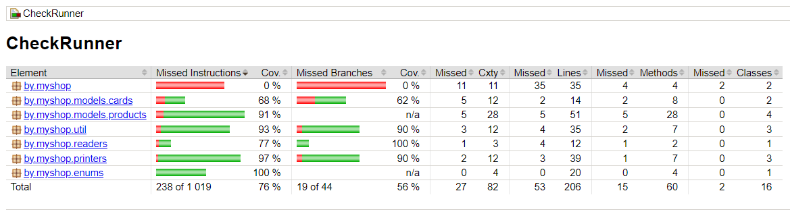

# test-project
Приложение, реализующее функционал формирования чека в магазине.  
Использованные технологии: Java 17 SE, Gradle 7.5.

- основной класс `CheckRunner` в методе `main` принимает массив строк `args` и парсит его;
- если на вход пришло имя файла, класс `InputFileReader` пытается прочитать данные из него. При положительном
исходе передаёт считанные данные обратно в массив `args`, в противном случае работа программы завершается;
- если на вход переданы сами данные, они парсятся с помощью регулярных выражений. Если данные переданы некорректно,
работа программы завершается;
- после ввода номера дисконтной карты обработка данных завершается. Даже если в массиве `args` ещё есть данные,
они не будут учтены;
- класс `ProductsFactory` - это фабрика по производству продуктов на основе переданного `LinkedHashMap`;
- класс `CardsFactory` - фабрика, производящая дисконтные карты на основе заданного массива чисел;
- чек формируется в классе `CheckMaker` с помощью `StringBuilder`;
- класс `CheckPrinter` получает список товаров от `ProductsFactory`, применяет скидки, вычисляет сэкономленную 
сумму;
- класс `CheckWriter` в любом случае записывает чек в папку с архивом. Если папки нет, создаёт её. Примеры чеков 
можно увидеть в папке `archive`.

Чтобы запустить проект, нужно собрать его с помощью команды `gradle clean test build`. Расположение проекта на
моем компьютере: `D:\work\repository\test-project`. Нужно создать такую же структуру папок, или исправить 
пути в классах `CheckWriter`, `CheckWriterTest`, `InputFileReaderTest`.

Собранный файл `gradle` положит в папку `build\libs`, откуда его можно запустить командой 
`java -jar CheckRunner.jar`, добавив аргументы.

Также можно напрямую запустить скомпилированный класс `CheckRunner.class` из папки `out\production\classes` 
командой: `java CheckRunner` + аргументы.

Отчет покрытия тестами (JaCoCo):
